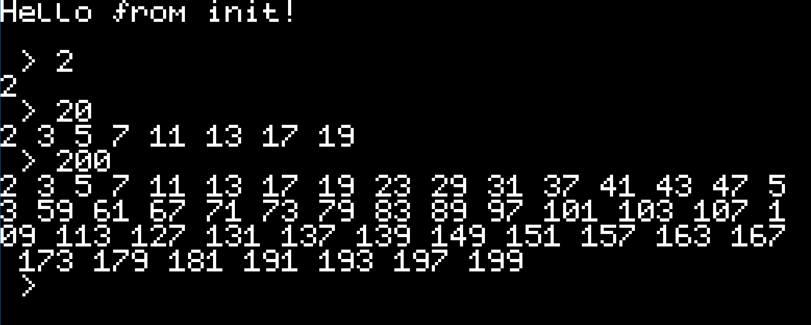

# A Level AQA EPQ 2023

I chose to do an EPQ on the subject of designing an instruction set architecture for a hypothetical custom CPU, implementing an emulator for it,
then taking that a step further by writing an assembler and a small OS for this computer. The emulator is for a system with a screen - an X11 window, and a keyboard - X11 keycode input.

My OS can be found in `src/source_files`.

Please see the lengthy [technical specification](techspec.pdf) document for a (hopefully) comprehensive explanation of all the code in my project.
The original Git history and a brief explanation of changes in each commit can be found [here](journal.pdf).

## How to run it
On a Linux computer with Python >= 3.10, and X11 windowing system:
```
cd src
./build.sh
./run.sh
```

## Picture
The init system, which is the first user-mode program loaded after the kernel, accepts and displays keyboard input at a prompt.
When the enter key is pressed, it treats the input as a number and prints all primes less than or equal to that number.
If no input is provided, the computer terminates.


